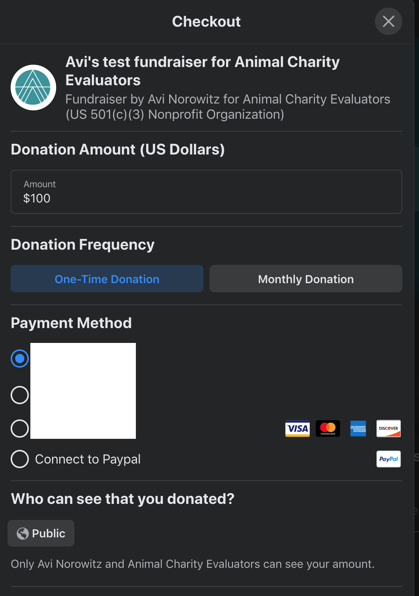
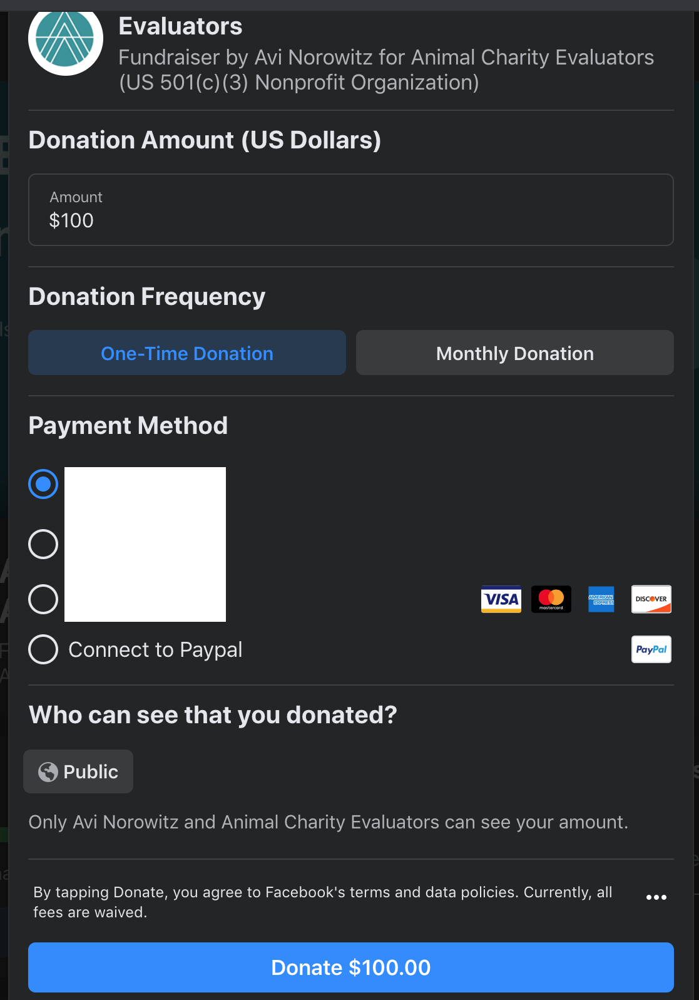

# EA Giving Tuesday Practice Simulator

## Objective

Create a simulator to help folks practice donating quickly in preparation for EAGT 2020, similar to this [very basic version](https://angelinahli.com/eagt.html).

## Specifications

On top of the basic version:

1. Have options both for "Confirm Your Donation" and not "Confirm Your Donation" practice. (Probably based on radio buttons somewhere.)
2. Use a free clock API instead of the system clock.
3. Don't permit a second click of the donate button until the page is refreshed.
4. Change UI to be consistent with FB UI as much as possible.

## References

e.g.:

